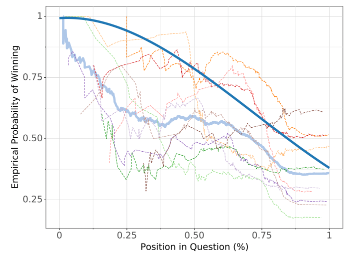

Buzz When You Know: QuizBowl Feature Engineering
=

The goal of this assignment is to understand the components of a simple QuizBowl QA system (i.e guesser, buzzer), analyze the data, and engineer a better Buzzer.

A quick review on the QuizBowl system:
-
There is a **Guesser**, which memorizes the questions and answers in the training set. For a new in-the-wild question, the guesser fetches the *K* closest questions in the memory and prepares the answers to those as potential responses. For this assignment, we use a [TF-IDF](https://www.wikiwand.com/en/Tf%E2%80%93idf) based Guesser provided in `tfidf_guesser.py`

Along with the guesser, we have a **Buzzer**, which buzzes (gives off a binary signal) when the system is confident to respond with its guess. For this assignment, we will be using a simple Logistic Regression based Buzzer as provided in `lr_buzzer.py`.

In practice, after each new word is consumed, the QB system tries to make new *K* guesses using tfidf guesser over the already consumed prefix, and the Buzzer will go off if the confidence crosses the threshold, in this case 0.5. For simplicity, the guess with the highest score will be considered as the final prediction of the system.

What's the task?
-

You will build on the *tf-idf guesser* by extracting useful information from its guesses and generate better features for input into the *logistic regression* classifier to do a better job of selecting whether a guess to a question is correct.

NOTE: Because the goal of this assignment is feature engineering, not classification algorithms, you may not change the underlying algorithm. You are only required to make changes in the `feateng` directory. Particularly, you must reimplement `prepare_train_inputs` and `prepare_eval_input` to achieve stronger results than baseline. You can change the outputs of tf-idf (e.g., to create a new feature) in `make_guess_dicts_from_question` function in `feateng/feat_utils.py`, but you may not swap out tf-idf for BM25.  Likewise, you cannot add hidden layers to the your logistic regression buzzer.

This assignment is structured in a way that approximates how classification works in the real world: features are typically underspecified (or not specified at all). You, the data digger, have to articulate the features you need. You then compete against others to provide useful predictions.

Data
----
Due to Github limits, we only provide you a small subset of training and validation data in the Homework repo. You can find the full train and validation fold [here](https://drive.google.com/drive/folders/1eqV6SPS8gNCyLTF2sKByi-aBF1tsmcZC). 

You can also use following scripts to download the full train and val data:
```
# Train Data
wget "https://obj.umiacs.umd.edu/qanta-jmlr-datasets/qanta.train.2021.12.20.json"

# Validation Data
wget "https://obj.umiacs.umd.edu/qanta-jmlr-datasets/qanta.dev.2021.12.20.json"
```
However, caution the size of the above folds. Using all of them for experimentation might decrease your iteration speed significantly.

The leaderboard score that determines the grade will be evaluated on a held-out test data.

It may seem straightforward, but do not start this at the last minute. There are often many things that go wrong in testing out features, and you'll want to make sure your features work well once you've found them.

What Can You Do?
------------------

You can:
* Add features in `make_guess_dicts_from_question` function in `feateng/feat_utils.py`
* Change feature representations in `prepare_train_inputs` and `prepare_eval_input` functions. (More explanation in their doc string)
* Exclude training data 
* Add training data

What Can't You Do?
------------------
Remove tf-idf as guesser or logistic regression as buzzer.
Change the logic of tfidf_guesser.py, lr_buzzer.py, qbdata.py


How to start
------------
1. Play around and get used to using tfidf_guesser.py and lr_buzzer.py
2. Add a simple feature to the training data generated by tfidf_guesser.py 
3. See if it increases the accuracy on held-out data when you run logistic regression (lr_buzzer.py) or on the leaderboard
4. Rinse and repeat!


How is the performance of a QuizBowl system measured?
---
Note that running `lr_buzzer.py` gives you the accuracy of your buzzer across all guesses. However, for a realtime Quizbowl system, it's also better to press the buzzer early on than later. We use the metric *expected_win_probability (EW)*  as defined in [Quizbowl: The Case for Incremental Question Answering](https://arxiv.orghttps://arxiv.org/pdf/1904.04792.pdf).

### **Expected Win Probability**

A winning system is the one that is the first one to buzz and answer the question correctly.

For a given system and a question, Guesser generates top K guesses at different positions. 

The Buzzer looks at the guesses at each position from start to end, considering the highest scored guess as the final prediction.

When the buzzer buzzes, we stop looking further, and evaluate whether the top guess at that point was indeed the correct guess.

However, the longer the buzzer waits before buzzing, system's likelihood of being the first one to buzz drops.

We reward expected score based on the winning_players_proportion(t) at that point (Figure below). An average across all examples in the eval set determines the final score.



Leaderboard Score (25+ points)
------------------------------

25 points of your score will be generated from your performance on the
the classification competition on the leaderboard.  The performance will be
evaluated on expected win probability on a held-out test set.

You should be able to significantly
improve on the baseline system.  If you can
do much better than your peers, you can earn extra credit (up to 10 points).

Analysis (25 Points)
--------------

The job of the written portion of the homework is to convince the grader that:
* Your new features work
* You understand what the new features are doing
* You had a clear methodology for incorporating the new features

Make sure that you have examples and quantitative evidence that your
features are working well, and include the metrics you chose to measure your system's performance. Be sure to explain how used the data
(e.g., did you have a development set?) and how you inspected the
results.

A sure way of getting a low grade is simply listing what you tried and
reporting the corresponding metrics for each attempt.  You are expected to pay more
attention to what is going on with the data and take a data-driven
approach to feature engineering.

How to Turn in Your System
---------------------------
```
- feateng/
    |-- __init__.py
    |-- feat_utils.py
    --- ... (extra .py files)
- models/
    |-- tfidf.pickle
    |-- lr_buzzer.pickle
    --- guess.vocab
- requirements.txt (Optional)
- gather_resources.sh (Optional)
- custom_data/ (Optional)
    |-- custom.buzztrain.json (Optional)
    --- custom.buzzdev.json (Optional)
```
* You are only required to make code changes within `feateng` directory and provide trained TfidfGuesser model (as `tfidf.pickle`), LogRegBuzzer model as `lr_buzzer.pickle`, and guess vocab (as `guess.vocab`) within `models` directory. The file provided should take care of saving the trained model at it's required place.
* You would not need to change any other python files, but feel free to play around with the code and make changes if needed. However, all the code changes outside of `feateng` would be discarded when submitted on gradescope and the Autograder would use the original version of the files provided in the repo.
* `requirements.txt`: You will be given following packages in the runtime environment. If you want to use other python packages in your solution, please provide them in a `requirements.txt` file at the root level. However, you mostly won't be needing any additional packages, and installing these packages would be counted towards the submission runtime limit (40 minutes). Python Packages in environment:
  * scikit-learn
  * numpy
  * nltk
  
**If you do not correctly save your trained model, or do not submit one at all, the autograder will fail.**
* **Custom Training Data** (If you used additional training data beyond ``small.guesstrain.json`` or ``small.buzztrain.json``
    * ``custom.guesstrain.json``: If you used additional training data for the guesser, please include the source data in your Gradescope submission in a file named ``custom.guesstrain.json`` within `custom_data` dir (if your file is <100MB).
    * ``custom.buzztrain.json``: If you used additional training data for the buzzer, please include the source data in your Gradescope submission in a file named ``custom.buzztrain.json`` within `custom_data` dir (if your file is <100MB).
* **IMPORTANT**: If any of your files are >100MB, please submit a shell script named ``gather_resources.sh`` that will retrieve the files programmatically from a public location (e.g. a public S3 bucket) and save them in the required directory. An example `gather_resources.sh` could look like following:
```
wget "https://url/for/tfidf.pickle"
mv tfidf.pickle models/

wget "https://url/for/train/data/qanta.train.json
mkdir custom_data
mv qanta.train.json custom_data/custom.guesstrain.json
```
To host any custom model files, you can any public file hosting service as long as they can allow a GET request to download the same. A Tutorial for using the Amazon AWS S3 for their 5GB Free tier is now provided in this repo [here](../tutorials/aws-s3.md)

Turn in the above files via Gradescope through a zip format such that `feateng`, `models`, `custom_data`, `gather_resources.sh` and `requirements.txt` are all at the root level. We'll be using the leaderboard as before over Accuracy and Expected Win Probability measure.


``analysis.pdf``: Your **PDF** file containing your feature engineering analysis. There will be a separate Grades scope assignment created to submit this.

**Leaderboard name:** Please keep your submission name as Group {group_number}: {whatever you like}, and don't forget to add your team members as part of the submission on Gradescope!

HAPPY FEATURE ENGINEERING!!
