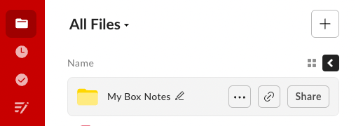
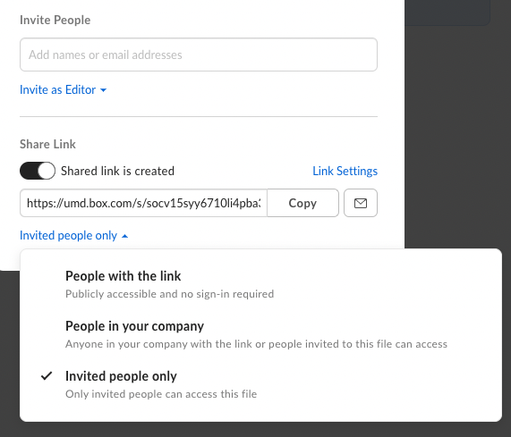
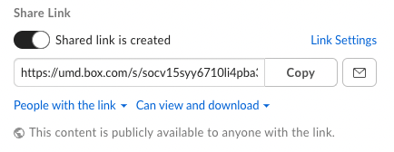
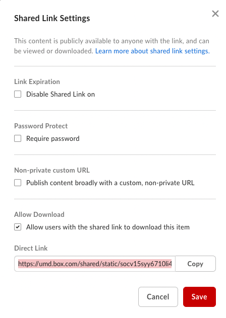

Hosting files on Box for public download
==

[Box](https://www.box.com/) is a secure storage service which allows users to host files and enable them to be downloaded through a direct download link. In this tutorial we will demonstrate on using Box for hosting required files for this Homework.

All UMD students should be able to use this service for free.

## Steps:

Let's assume you want to host `tfidf.pickle` file on **Box** and download this file from any arbitrary unix-based machine through a shell script using either a `wget` or `curl` command.

1. Login (or Sign up) to your Box account at umd.box.com
2. Once logged in, select on "All Files" on the left and click on "+" button on the right. (Figure below)
   


3. Select "File Upload" and choose the `tfidf.pickle` file on your local machine.
4. Once the file has been successfully uploaded, we now try to get the direct-download link of this file.
5. Select the file `tfidf.pickle` in **All Files** dashboard, and click on the **Share** button. (Figure below)
   


6. Turn ON the **Share Link toggle button**, and change the access from **Invited people only** to **People with the link**. (Figure below)



7. The file is now public and anyone with the link can download it from the browser. However this link is NOT a direct download link. To get the direct download link that your browser redirects to when you go to the share link, Click on the **Link Settings** as in the above figure. You should see a pop like this:



8. Make sure that the checkbox in **Auto Download** section is selected.

9. You can copy the Direct Link and use this to download the file from a bash script as follows. Let's say the Direct Link is something like `https://umd.box.com/shared/static/<some_identifier>.pickle`

You can download the files using one of the following commands.

```bash
wget -O tfidf.pickle https://umd.box.com/shared/static/<some_identifier>.pickle
```

```bash
curl -L https://umd.box.com/shared/static/<some_identifier>.pickle --output tfidf.pickle
```


