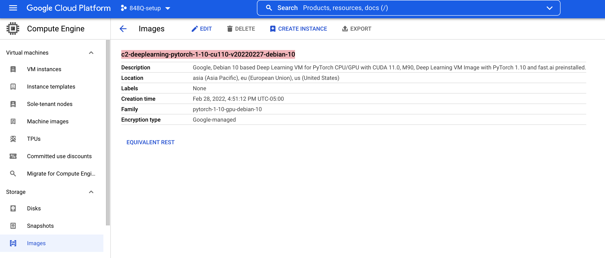
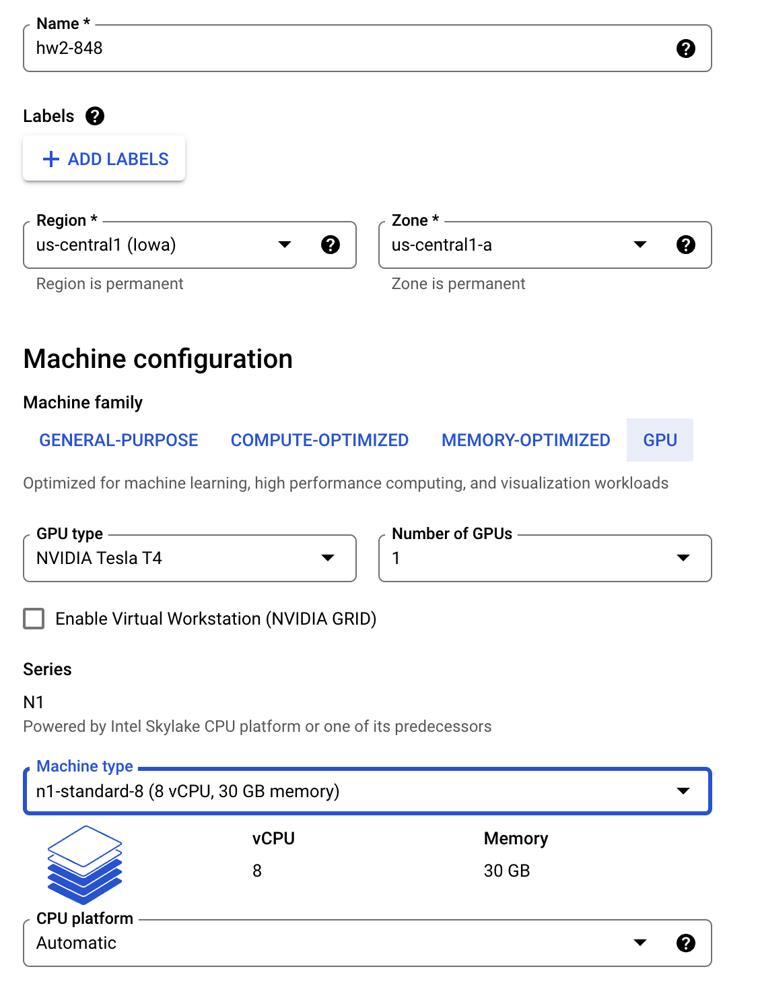
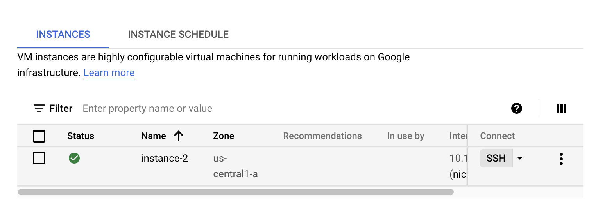

# Setting up a Instance on Google Cloud Platform for PyTorch

## Quickly **Setting up a GPU Instance with Pytorch and CUDA libraries.**

1. Enable the Compute Engine API here [https://cloud.google.com/compute](https://cloud.google.com/compute)
2. From the Dashboard, Go to Storage > Images 
3. Search for “**pytorch”** and select ****c2-deeplearning-pytorch-1-10-cu110-v20220227-debian-10****



1. Now click on **Create Instance**, you will be directed to Instance creation page.

2. Name your instance, Select appropriate location and zone.
3. Select “**GPU”** in Machine Configuration > Machine Family Section
4. Select GPU type as K80 / P4 / T4 since they are relatively affordable ones and number of GPUs to 1
5. For Machine type, select **n1-standard-8 (8 vCPU, 30 GB memory)**
6. Enable display device if you want to.
7. Leave everything else to default settings and click  **“CREATE”**
8. Now if you don’t have the GPU quota this might fail to create an instance, but that’s OKAY
9.  If it failed, click on the red alert icon and request to raise the GPU quota with a reasonable description: “Need GPU to train Deep learning models for course project” should be sufficient.
10. Wait for the approval (should take less than 20 minutes, ~2 minutes on average case)
11. Once you have the approval (via email), Go to the VM instance dashboard, and try to spawn the instance by clicking the refresh button.

**CONGRATS! You now have an instance with a GPU!!**

### What you do after the instance is ready ?

1. Click on the **SSH button** to log into your instance. (See image below)



1. Don’t have a popup blocker, else the ssh window might not open.
2. First time you ssh, you will be prompted with an option to install Nvidia driver. Select Yes.
3. If something goes wrong, you can manually install the drivers using

```bash
curl https://raw.githubusercontent.com/GoogleCloudPlatform/compute-gpu-installation/main/linux/install_gpu_driver.py --output install_gpu_driver.py

sudo python3 install_gpu_driver.py
```

Now run this command to check if you can access GPU using Pytorch

```bash
python3 -c "import torch; print(torch.cuda.is_available())"
```

You will have conda on this machine. You can create a Python 3.6 environment and setup the project stub using:

```bash
conda create -n 848q python=3.6
conda activate 848q

git clone https://github.com/Pinafore/848-hw.git
cd hw2
pip install -r requirements.txt
```

If you run into some issues where pip complains some `certifi` uninstallation problem, you can refer this page to resolve that:
https://community.home-assistant.io/t/cannot-uninstall-certifi-on-upgrade-attempt/55570